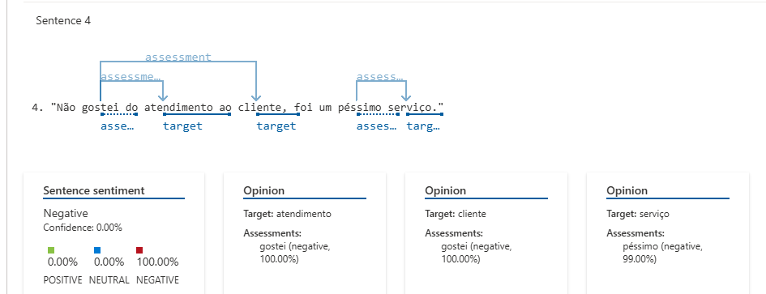

# analyze-sentiment-azure
Projeto de análises de sentimento com Azure AI

## Descrição do Projeto

Neste projeto, utilizei o recurso de **Analyze Sentiment and Opinions** do Azure AI para analisar diferentes sentenças e entender como a IA classifica sentimentos, emoções e intenções. A análise foi feita com base em frases de diferentes contextos, abrangendo sentimentos positivos, negativos e neutros.

## Processo de Criação

1. **Criação do Repositório**: Foi criado um repositório no GitHub para documentar todo o processo.
2. **Preparação dos Dados**: Um arquivo de texto com sentenças variadas foi criado na pasta `inputs/`.
3. **Análise com Azure AI**: Utilizei o serviço de Análise de Sentimentos do Azure para classificar e extrair insights sobre os sentimentos expressos nas sentenças.

## Como Funciona a Análise de Sentimentos no Azure AI

A análise de sentimentos do Azure AI utiliza algoritmos de processamento de linguagem natural (PNL) para identificar o tom emocional de um texto. Ele classifica as sentenças em uma escala de 0 a 1, onde 0 representa um sentimento negativo e 1 representa um sentimento positivo. Além disso, a ferramenta pode identificar a intensidade da emoção e fornecer uma visão geral sobre as opiniões expressas no texto.

## Resultados Obtidos

Resultado da Análise de Sentimentos:
Confiabilidade: 49.00%
Sentimentos Identificados:
  * Positivo: 49.00%
  * Neutro: 1.00%
  * Negativo: 50.00%

Aqui estão alguns exemplos das sentenças analisadas:

### Sentenças e Resultados

1. **"Eu amei o novo filme, a história é incrível e a atuação está maravilhosa!"**
   - **Sentimento**: Positivo
   - **Intensidade**: Alta

2. **"Estou muito chateado com o atraso da entrega, isso me deixou frustrado."**
   - **Sentimento**: Negativo
   - **Intensidade**: Alta

3. **"O produto é bom, mas o preço está um pouco alto para a qualidade oferecida."**
   - **Sentimento**: Neutro
   - **Intensidade**: Média
   - 
4. **"Não gostei do atendimento ao cliente, foi um péssimo serviço."**
   - **Sentimento**: Negativo
   - **Intensidade**: Alta

5. **"Estou muito animado com as novidades que foram anunciadas para o próximo semestre."**
   - **Sentimento**: Positivo
   - **Intensidade**: Alta

6. **"Esse restaurante é maravilhoso, sempre tenho uma experiência incrível quando vou lá."**
   - **Sentimento**: Positivo
   - **Intensidade**: Alta

7. **"Estou nervoso para a entrevista de amanhã, espero conseguir o emprego."**
   - **Sentimento**: Negativo
   - **Intensidade**: Alta

8. **"O evento foi um desastre, a organização deixou a desejar e fiquei muito decepcionado."**
   - **Sentimento**: Negativo
   - **Intensidade**: Alta
  
9. **"Achei a palestra interessante, mas um pouco longa. Algumas partes poderiam ser mais objetivas."**
   - **Sentimento**: Neutro
   - **Intensidade**: Média
  
10. **"A nova atualização do aplicativo me deixou mais satisfeito, ele está muito mais rápido agora."**
   - **Sentimento**: Positivo
   - **Intensidade**: Alta

## Insights e Possibilidades

Durante a análise, percebi que o Azure AI tem uma boa capacidade de distinguir entre emoções claras, como "amor" ou "ódio", mas também consegue identificar nuances e sentimentos mais equilibrados, como a insatisfação mista em relação a um produto. Isso pode ser útil em diversos cenários, como:

- **Análise de Feedback de Clientes**: Empresas podem usar esse tipo de análise para entender melhor as opiniões dos consumidores e melhorar seus serviços e produtos. Esse tipo de análise é útil para entender quando uma pessoa tem uma opinião dividida ou equilibrada sobre algo, sem um claro viés positivo ou negativo.
- **Monitoramento de Redes Sociais**: A ferramenta pode ser utilizada para analisar postagens e comentários em redes sociais, identificando tendências emocionais e possibilitando uma gestão mais eficaz de marca.
- **Aprimoramento de Serviços**: A análise pode ser aplicada para verificar como os clientes reagem a mudanças de serviços, produtos ou até campanhas publicitárias.

## Prints de Tela

Aqui estão algumas imagens do processo de análise no Azure:

- **Print 1**: Tela de carregamento do arquivo de sentenças.
- 
  
- **Print 2**: Resultados geral da análise de sentimentos.
- 

- **Print 3**: Resultado individual das sentenças.
- 
- 
- 
- 
- 
- 
- 
- 
- 
- 

---

## Conclusão

A análise de sentimentos com Azure AI mostrou-se eficaz para identificar emoções, opiniões e intenções no texto. Esse tipo de tecnologia tem um vasto campo de aplicação e pode ser extremamente útil em áreas de marketing, atendimento ao cliente e análise de dados em larga escala.
